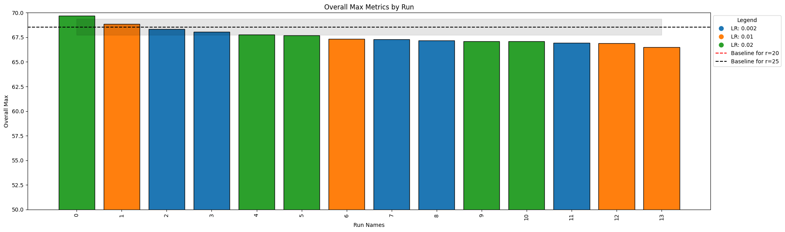
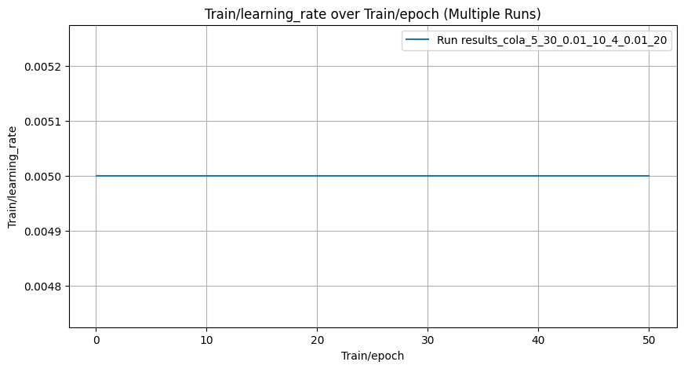
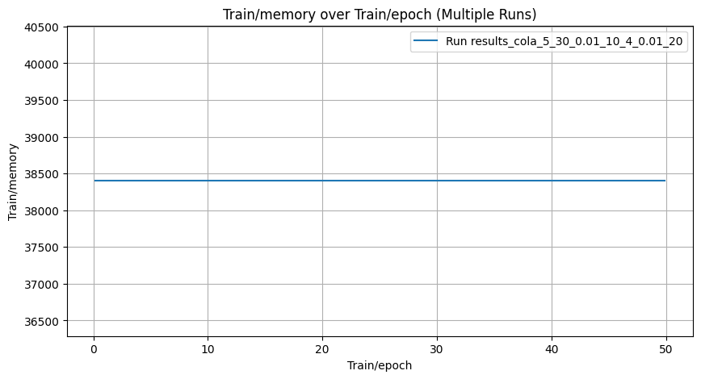
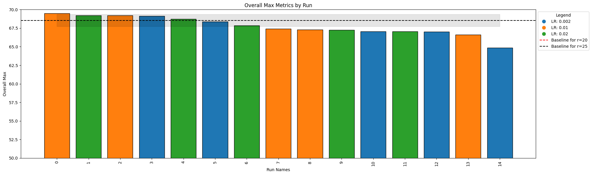
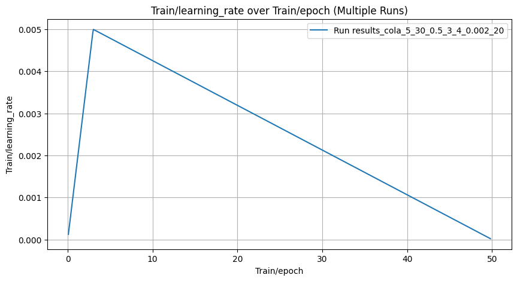
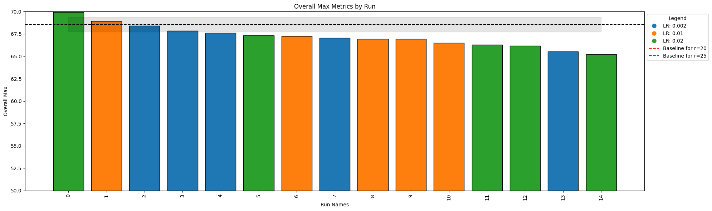
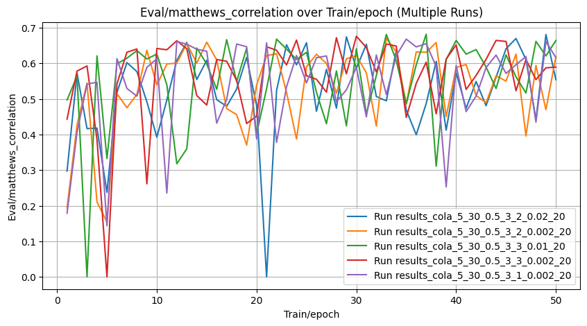

# Different alpha_min and alpha_max settings on CoLA Report

## Alpha min is 0.1, alpha max is 5

Alpha is growing linearly. rank_allocation_weights initialized to random, same scheduling, rank_max is 30, average rank is 20, rank_min is 5. Discrete rank on the last epoch. Constant scheduler for lr

Baseline: 68.08+-1.21
LoRA-XS with rank 25: 68.55+-0.81
Script:
```bash
  python scripts/run_glue_adaptive.py --target_task cola --wandb_disabled False  --seed $SEED \
  --rank_allocation_lr $rank_allocation_lr --epoch 50  --rank_min 5 --rank_max 30 --rank_average 20 --epochs_rank_discrete 1 \
  --lr_scheduler constant_schedule \
  --alpha_min 0.1 --alpha_max 5 
```


| Task   |   Rank Min |   Rank Max |   Alpha Min |   Alpha Max |    LR |   Rank Avg | Median ± Std   |
|:-------|-----------:|-----------:|------------:|------------:|------:|-----------:|:---------------|
| cola   |          5 |         30 |         0.1 |           5 | 0.02  |         20 | 67.70 ± 1.07   |
| cola   |          5 |         30 |         0.1 |           5 | 0.002 |         20 | 67.29 ± 0.61   |
| cola   |          5 |         30 |         0.1 |           5 | 0.01  |         20 | 67.11 ± 1.03   |


    


    

    


The results are slightly below the baseline


    

    


    

    


    

    


## Alpha min is 0.01, alpha max is 10

Alpha is growing linearly. rank_allocation_weights initialized to random, same scheduling, rank_max is 30, average rank is 20, rank_min is 5. Discrete rank on the last epoch. Constant scheduler for lr

Baseline: 68.08+-1.21
LoRA-XS with rank 25: 68.55+-0.81

Script:
```bash
  python scripts/run_glue_adaptive.py --target_task cola --wandb_disabled False  --seed $SEED \
  --rank_allocation_lr $rank_allocation_lr --epoch 50  --rank_min 5 --rank_max 30 --rank_average 20 --epochs_rank_discrete 1 \
  --lr_scheduler constant_schedule \
  --alpha_min 0.01 --alpha_max 10 
```


| Task   |   Rank Min |   Rank Max |   Alpha Min |   Alpha Max |    LR |   Rank Avg | Median ± Std   |
|:-------|-----------:|-----------:|------------:|------------:|------:|-----------:|:---------------|
| cola   |          5 |         30 |        0.01 |          10 | 0.002 |         20 | 67.60 ± 1.10   |
| cola   |          5 |         30 |        0.01 |          10 | 0.01  |         20 | 66.94 ± 0.96   |
| cola   |          5 |         30 |        0.01 |          10 | 0.02  |         20 | 66.29 ± 1.80   |


    


    

    


The results are slightly below the baseline


    

    


## Alpha min is 0.5, alpha max is 3 - setup used for most of the experiments

Alpha is growing linearly. rank_allocation_weights initialized to random, same scheduling, rank_max is 30, average rank is 20, rank_min is 5. Discrete rank on the last epoch. Constant scheduler for lr

Baseline: 68.08+-1.21
LoRA-XS with rank 25: 68.55+-0.81

Script:
```bash
  python scripts/run_glue_adaptive.py --target_task cola --wandb_disabled False  --seed $SEED \
  --rank_allocation_lr $rank_allocation_lr --epoch 50  --rank_min 5 --rank_max 30 --rank_average 20 --epochs_rank_discrete 1 \
  --lr_scheduler constant_schedule \
  --alpha_min 0.5 --alpha_max 3
```


| Task   |   Rank Min |   Rank Max |   Alpha Min |   Alpha Max |    LR |   Rank Avg | Median ± Std   |
|:-------|-----------:|-----------:|------------:|------------:|------:|-----------:|:---------------|
| cola   |          5 |         30 |         0.5 |           3 | 0.01  |         20 | 68.19 ± 1.03   |
| cola   |          5 |         30 |         0.5 |           3 | 0.02  |         20 | 67.39 ± 1.14   |
| cola   |          5 |         30 |         0.5 |           3 | 0.002 |         20 | 67.07 ± 1.13   |


    


    

    


The results are above the baseline by 0.11! However, the results for same alphas but rank max=25 and non constant linear scheduler are higher - 68.22 ± 1.05. See `tasks/adaptive_rank_allocation/lr/initializations_l_r/initializations_l_r_report.md`


    

    

