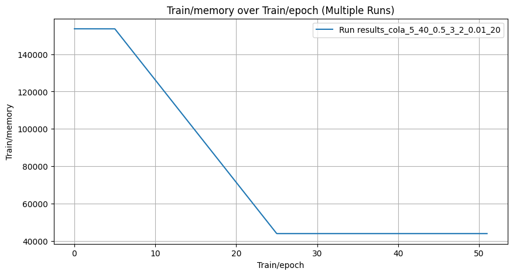
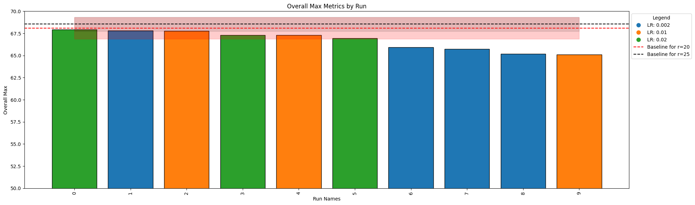
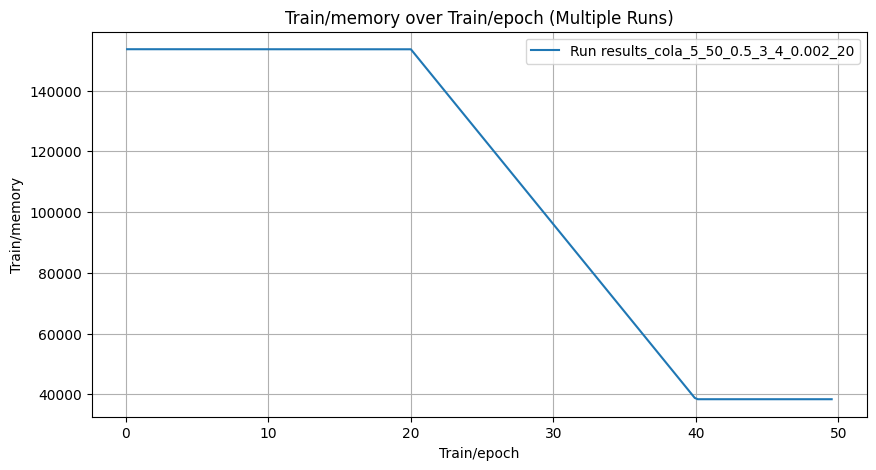
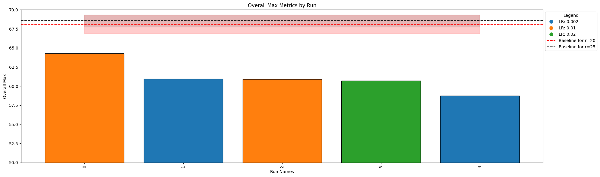
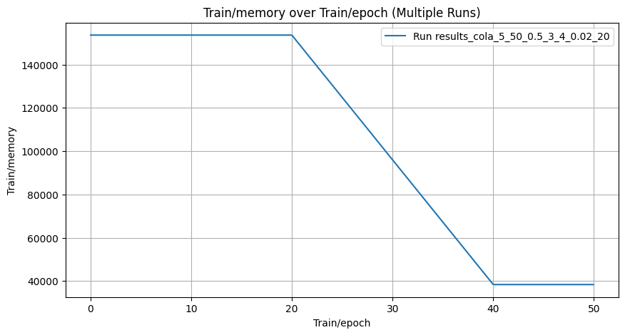
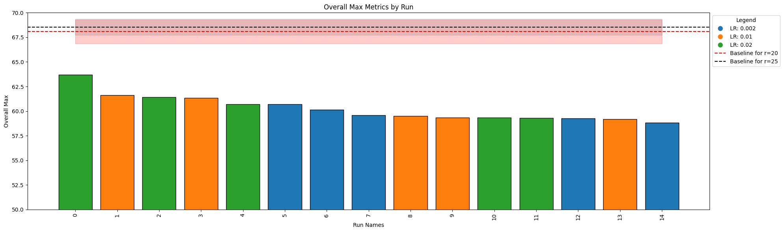
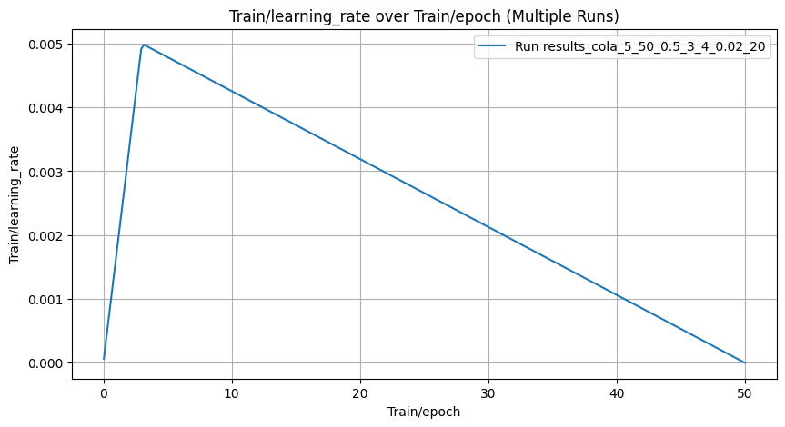

<!-- ### Uniform initialization (r=20 for every parameter matrix), grid search over learning rates and rank ranges, only 1 run for each learning rate -->

# Bigger to smaller memory on CoLA Report

# Randn initialization
Initial rank is 40, epochs 0-14 rank 40, epochs 15-24 rank 40->20, epoch 25-50 rank 20.
rank_allocation_weights initialized to random, same scheduling, discrete rank on the last epoch, rank_min is 5, rank_max is 40

    

    

| Task   |   Rank Min |   Rank Max |   Alpha Min |   Alpha Max |    LR |   Rank Avg | Median ± Std   |
|:-------|-----------:|-----------:|------------:|------------:|------:|-----------:|:---------------|
| cola   |          5 |         40 |         0.5 |           3 | 0.02  |         20 | 67.32 ± 0.50   |
| cola   |          5 |         40 |         0.5 |           3 | 0.01  |         20 | 67.29 ± 1.42   |
| cola   |          5 |         40 |         0.5 |           3 | 0.002 |         20 | 65.83 ± 1.14   |

    

    

    

Initial rank is 40, epochs 0-19 rank 40, epochs 20-39 rank 40->20, epoch 40-49 rank 20. 
rank_allocation_weights initialized to random, same scheduling, discrete rank on the last epoch, rank_min is 5, rank_max is 50

    

    

| Task   |   Rank Min |   Rank Max |   Alpha Min |   Alpha Max |    LR |   Rank Avg | Median ± Std   |
|:-------|-----------:|-----------:|------------:|------------:|------:|-----------:|:---------------|
| cola   |          5 |         50 |         0.5 |           3 | 0.01  |         20 | 62.60 ± 2.40   |
| cola   |          5 |         50 |         0.5 |           3 | 0.02  |         20 | 60.72 ± 0.00   |
| cola   |          5 |         50 |         0.5 |           3 | 0.002 |         20 | 59.85 ± 1.57   |

    

    

    

# Quadratic initialization
Initial rank is 40, epochs 0-19 rank 40, epochs 20-39 rank 40->20, epoch 40-49 rank 20. 
rank_allocation_weights initialized to quadratic, same scheduling, discrete rank on the last epoch, rank_min is 5, rank_max is 50

    

    

| Task   |   Rank Min |   Rank Max |   Alpha Min |   Alpha Max |    LR |   Rank Avg | Median ± Std   |
|:-------|-----------:|-----------:|------------:|------------:|------:|-----------:|:---------------|
| cola   |          5 |         50 |         0.5 |           3 | 0.02  |         20 | 60.70 ± 1.81   |
| cola   |          5 |         50 |         0.5 |           3 | 0.002 |         20 | 59.60 ± 0.73   |
| cola   |          5 |         50 |         0.5 |           3 | 0.01  |         20 | 59.50 ± 1.19   |

    

    

    

### Learning rate for all of the experiments

    

    

