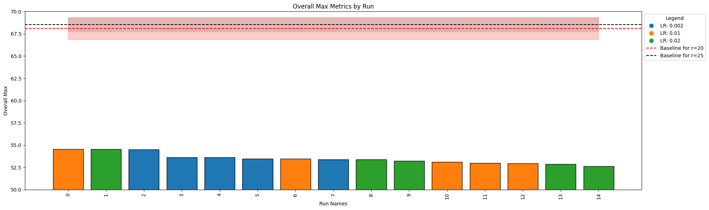
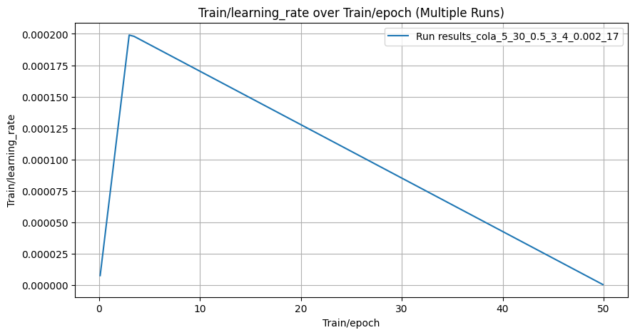
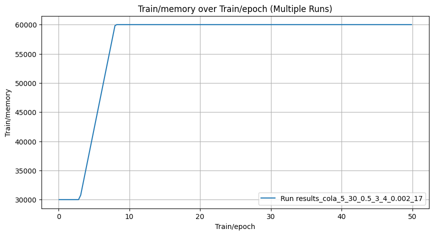
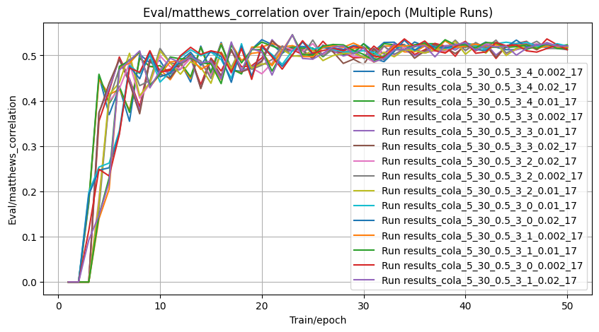

<!-- ### Uniform initialization (r=20 for every parameter matrix), grid search over learning rates and rank ranges, only 1 run for each learning rate -->

# Smaller to biger memory on CoLA Report

Initial memory is two times smaller than memory for average rank of 25 for epochs 0-2, then it grows linearly on epochs 3-7 and stabilized at memory that is average for rank of 25 on epochs 8-49.  rank_allocation_weights initialized to random, same scheduling, discrete rank on the last epoch.


Script:
```bash
python scripts/run_glue_adaptive.py --target_task cola --wandb_disabled False  --seed $SEED --rank_allocation_lr $rank_allocation_lr --epoch 50  --rank_min 5 --rank_max 30 --memory_start 30000 --memory_end 60000 --epochs_memory_start 3 --epochs_memory_start_to_end 5 --epochs_rank_discrete 1 
```


| Task   |   Rank Min |   Rank Max |   Alpha Min |   Alpha Max |    LR |   Rank Avg | Median ± Std   |
|:-------|-----------:|-----------:|------------:|------------:|------:|-----------:|:---------------|
| cola   |          5 |         30 |         0.5 |           3 | 0.002 |         17 | 53.65 ± 0.45   |
| cola   |          5 |         30 |         0.5 |           3 | 0.02  |         17 | 53.23 ± 0.75   |
| cola   |          5 |         30 |         0.5 |           3 | 0.01  |         17 | 53.12 ± 0.67   |


    


    

    


The problem might be that the model learns the most during the first epochs and it doesn't have the whole memory at the start. Other thing is that the learning rate scheduler is not alligned with memory scheduler - the lerning rate is decreasing when the model has just gotten enough memory to learn.


    

    


    

    


    

    

