<!-- ### Uniform initialization (r=20 for every parameter matrix), grid search over learning rates and rank ranges, only 1 run for each learning rate -->

## Uniform initialization

Baseline: 68.08 ± 1.21, Rank 25: 68.55 ± 0.81 - uniform is bellow the baseline

| Task   |   Rank Min |   Rank Max |   Alpha Min |   Alpha Max |    LR |   Rank Avg | Median ± Std   |
|:-------|-----------:|-----------:|------------:|------------:|------:|-----------:|:---------------|
| cola   |          5 |         25 |         0.5 |           3 | 0.001 |         20 | 67.84 ± 0.87   |
| cola   |          5 |         25 |         0.5 |           3 | 0.02  |         20 | 67.75 ± 1.81   |
| cola   |          5 |         25 |         0.5 |           3 | 0.002 |         20 | 67.30 ± 0.37   |
| cola   |          5 |         25 |         0.5 |           3 | 0.01  |         20 | 67.05 ± 1.04   |
| cola   |          5 |         25 |         0.5 |           3 | 0.005 |         20 | 66.94 ± 0.52   |

    

    
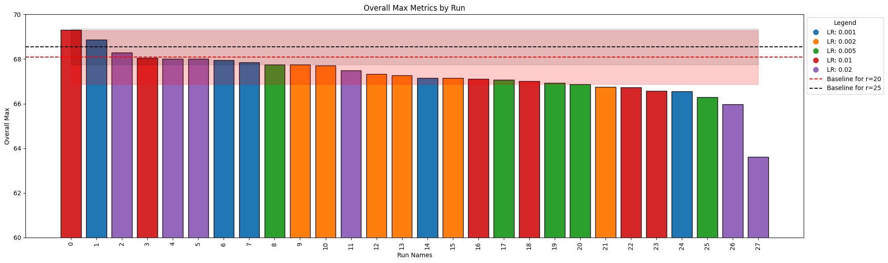
    

    
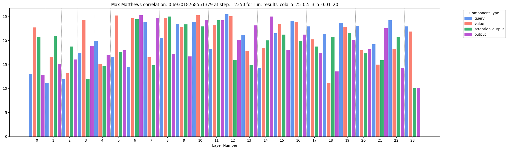
    

    
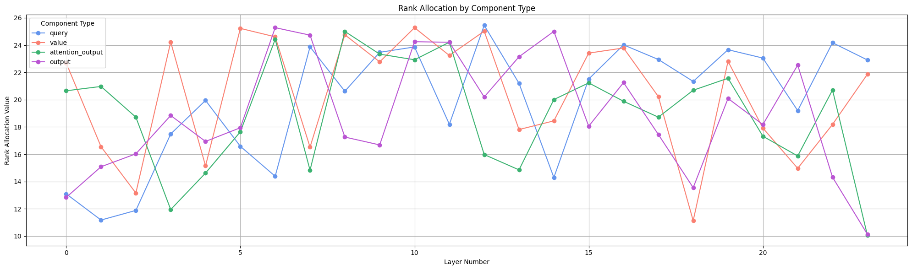
    

## Randn initialization

Baseline: 68.08 ± 1.21, Rank 25: 68.55 ± 0.81 - 
randn is **above the baseline** for LR=0.002 

| Task   |   Rank Min |   Rank Max |   Alpha Min |   Alpha Max |    LR |   Rank Avg | Median ± Std   |
|:-------|-----------:|-----------:|------------:|------------:|------:|-----------:|:---------------|
| cola   |          5 |         25 |         0.5 |           3 | 0.002 |         20 | 68.22 ± 1.05   |
| cola   |          5 |         25 |         0.5 |           3 | 0.01  |         20 | 67.60 ± 0.94   |
| cola   |          5 |         25 |         0.5 |           3 | 0.02  |         20 | 67.48 ± 0.85   |
| cola   |          5 |         25 |         0.5 |           3 | 0.005 |         20 | 66.94 ± 1.20   |
| cola   |          5 |         25 |         0.5 |           3 | 0.001 |         20 | 65.92 ± 0.80   |

    

    
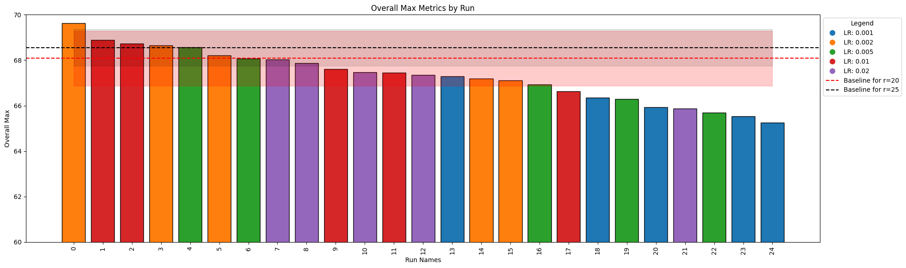
    

    
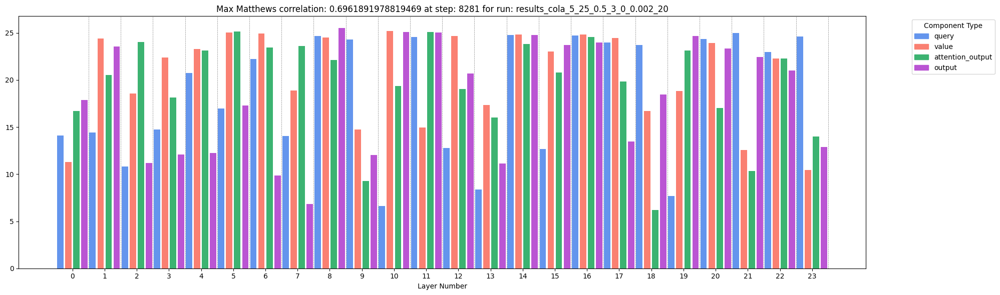
    

    
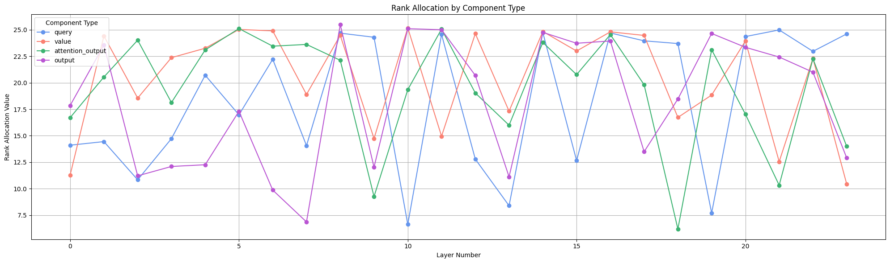
    

## Quadratic initialization

Baseline: 68.08 ± 1.21, Rank 25: 68.55 ± 0.81 - quadratic is slightly above the baseline

| Task   |   Rank Min |   Rank Max |   Alpha Min |   Alpha Max |    LR |   Rank Avg | Median ± Std   |
|:-------|-----------:|-----------:|------------:|------------:|------:|-----------:|:---------------|
| cola   |          5 |         25 |         0.5 |           3 | 0.02  |         20 | 68.13 ± 0.84   |
| cola   |          5 |         25 |         0.5 |           3 | 0.002 |         20 | 67.92 ± 0.46   |
| cola   |          5 |         25 |         0.5 |           3 | 0.01  |         20 | 67.10 ± 1.46   |
| cola   |          5 |         25 |         0.5 |           3 | 0.005 |         20 | 66.94 ± 1.20   |
| cola   |          5 |         25 |         0.5 |           3 | 0.001 |         20 | 65.92 ± 0.80   |

    

    
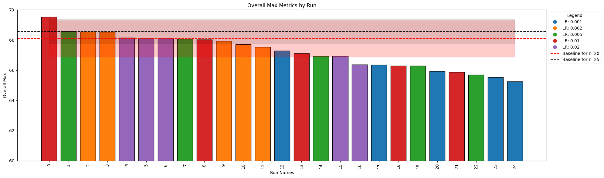
    

    
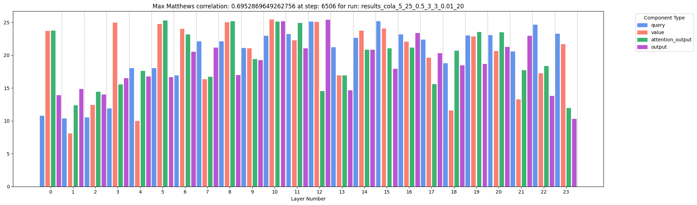
    

    
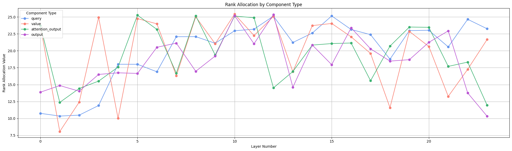
    

## Left skewed (centered at 3/4*n) initialization

Baseline: 68.08 ± 1.21, Rank 25: 68.55 ± 0.81 - left skewed is bellow the baseline

| Task   |   Rank Min |   Rank Max |   Alpha Min |   Alpha Max |    LR |   Rank Avg | Median ± Std   |
|:-------|-----------:|-----------:|------------:|------------:|------:|-----------:|:---------------|
| cola   |          5 |         25 |         0.5 |           3 | 0.005 |         20 | 67.78 ± 1.21   |
| cola   |          5 |         25 |         0.5 |           3 | 0.01  |         20 | 67.19 ± 2.00   |
| cola   |          5 |         25 |         0.5 |           3 | 0.001 |         20 | 67.16 ± 0.99   |
| cola   |          5 |         25 |         0.5 |           3 | 0.002 |         20 | 67.14 ± 0.92   |
| cola   |          5 |         25 |         0.5 |           3 | 0.02  |         20 | 65.56 ± 0.95   |

    

    
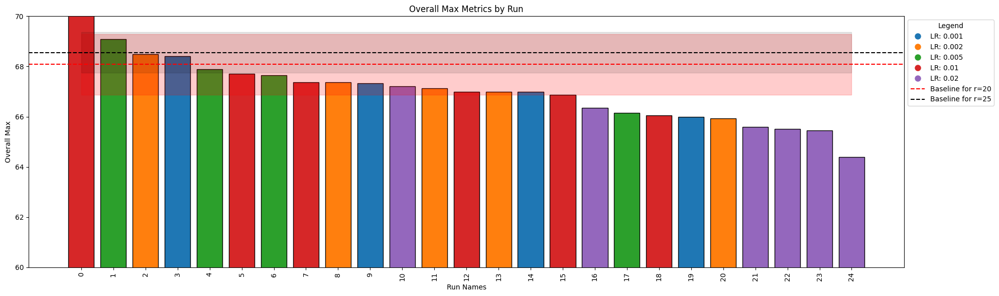
    

    
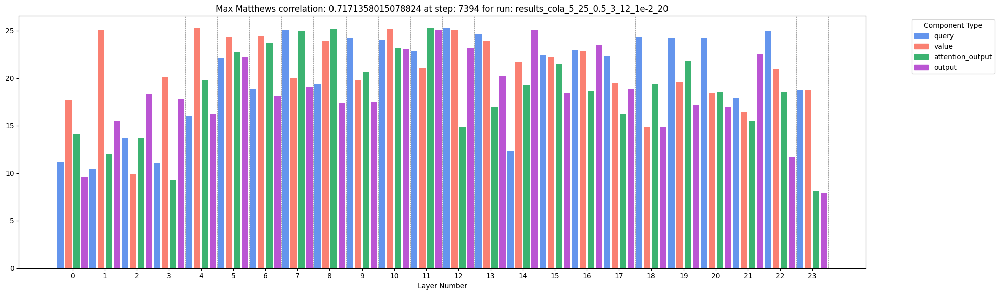
    

    
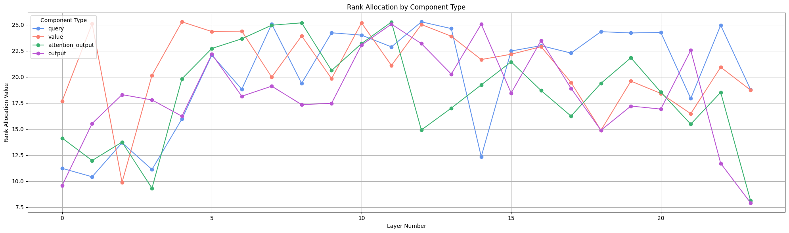
    

## Uniform, randn, quadratic, left-skewed comparison
Randn initialization has the best results.

    
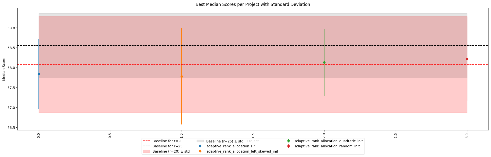
    

## Observations
At the beginning of the training (first 2 epochs), the ranks for first 33% of the layers are getting lower, while the ranks for 33% tend to get higher.

 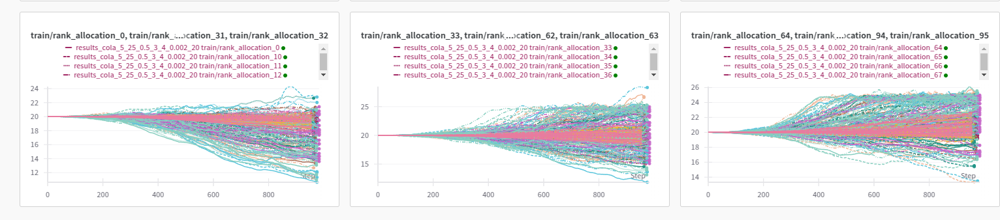

## References
The visualization of each of the initializations is located at algorithm_visualization.ipynb
Results are located at initializations_l_r_results.csv
