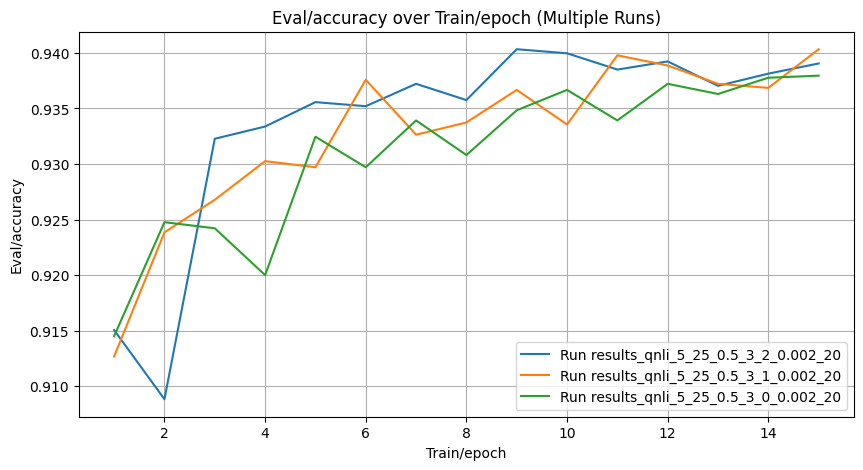
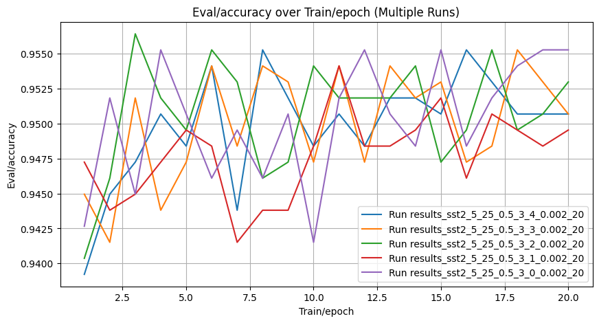

# Best Config Results – QNLI and SST-2
Hyperparameters used are the same as in LoRA-XS paper + current best configuration for Adaptive LoRA-XS.

## QNLI

rank_allocation_weights initialized to random, no alpha scheduler, rank_max is 25, average rank is 20, rank_min is 5. discrete rank on the last epoch. linear_schedule_with_warmup for lr

LoRA-XS with rank 25: 94.34 ± 0.22
Script:
```bash
python scripts/run_glue_adaptive.py --target_task qnli --wandb_disabled False  --seed $SEED \
--lr 2e-3 --cls_lr 6e-4 \
--rank_allocation_lr $rank_allocation_lr --epoch 15  --rank_min 5 --rank_max 25 --rank_average 20 --epochs_rank_discrete 1 \
--lr_scheduler linear_schedule_with_warmup \
--alpha_min 0.5 --alpha_max 3
```


| Task   |   Rank Min |   Rank Max |   Alpha Min |   Alpha Max |    LR |   Rank Avg | Median ± Std   |
|:-------|-----------:|-----------:|------------:|------------:|------:|-----------:|:---------------|
| qnli   |          5 |         25 |         0.5 |           3 | 0.002 |         20 | 94.03 ± 0.14   |


    


    

    


The results are slightly below the baseline

## SST2

rank_allocation_weights initialized to random, no alpha scheduler, rank_max is 25, average rank is 20, rank_min is 5. discrete rank on the last epoch. linear_schedule_with_warmup for lr

LoRA-XS with rank 25: 96.33 ± 0.15

Script:
```bash
python scripts/run_glue_adaptive.py --target_task sst2 --wandb_disabled False  --seed $SEED \
--lr 2e-3 --cls_lr 1e-3 \
--rank_allocation_lr $rank_allocation_lr --epoch 20  --rank_min 5 --rank_max 25 --rank_average 20 --epochs_rank_discrete 1 \
--lr_scheduler linear_schedule_with_warmup \
--alpha_min 0.5 --alpha_max 3

```


| Task   |   Rank Min |   Rank Max |   Alpha Min |   Alpha Max |    LR |   Rank Avg | Median ± Std   |
|:-------|-----------:|-----------:|------------:|------------:|------:|-----------:|:---------------|
| sst2   |          5 |         25 |         0.5 |           3 | 0.002 |         20 | 95.53 ± 0.08   |


    


    

    


The results are slightly below the baseline.
